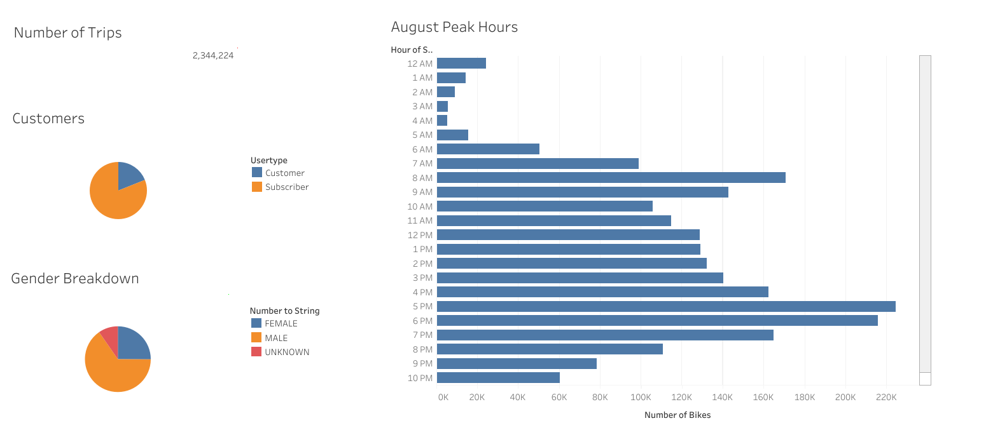
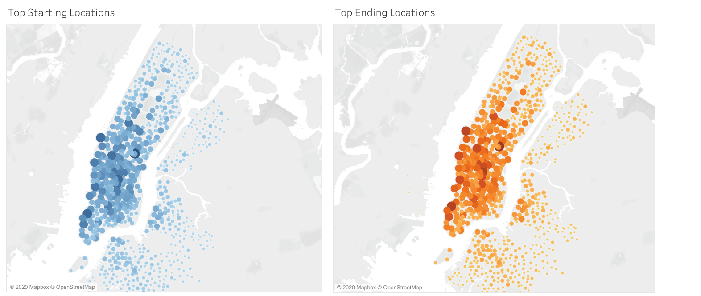
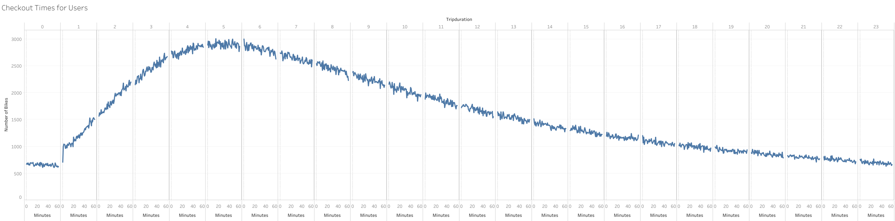
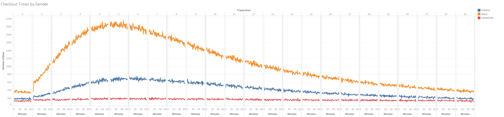
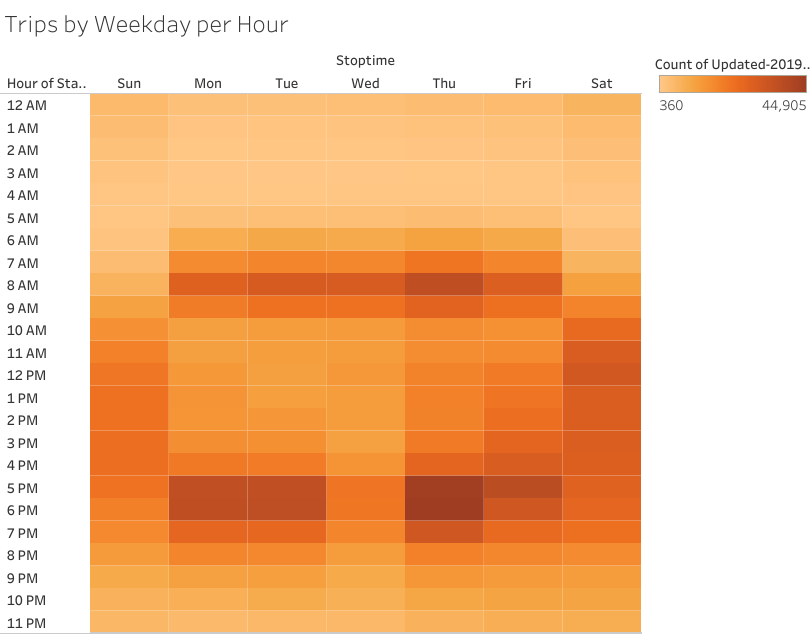
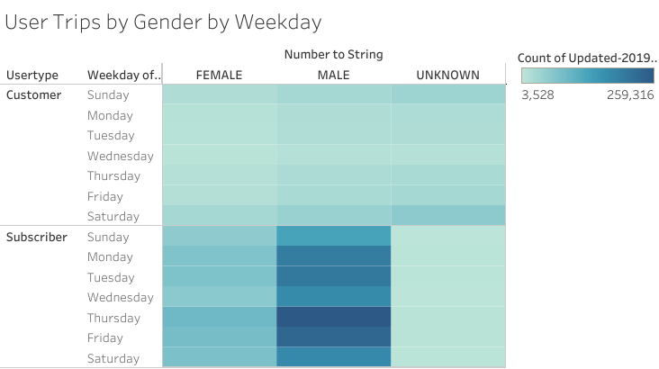

# Bike Sharing 

## Project Overview 
Citi Bike, a bicycle sharing system in New York City is used by travelers to get to know the city and interact with the people who live there and who reusing bikes for their commutes. Travelers use bikes to explore historic landmarks like Central Park, the Statue of Liberty, and the Empire State Building.  There is the potential to start a similar bike-share business in Des Moines, Lowa. Kate found a potential investor who might be interested in providing seed funding to explore a bike-share program in Des Moines. Realistically, the mechanics of making the business work might be quite different in Des Moines than in New York City. The first step is to figure out how the bike-share business works in New York City.
Second, create a proposal on how it might work in Des Moines.  Kate is gregarious, friendly, and fearless. She will be the face of the proposal put in front of the investors. To solidify the business proposal, one of the key stakeholders would like to see the following in the bike trip analysis:
- The length of time that bikes are checked out for all riders and genders.
- The number of bike trips for all riders and genders for each hour of each day of the week.
- The number of bike trips for each type of user and gender for each day of the week.

The Propose of this project is to explore Citibike data, create visualizations, and a story that will be used to pitch the investors that a bike-sharing program in Des Moines is a solid business prospect. 

## Result
### Citi Bike Data Overview
- 2,344,224 trips in August.
- 1,900,356 were Subsriber Users and 443,865 were Customer Users. 
- 1,530,272 were Males, 588,431 were Females and 225,521 were unknown users. 
- Peak trip start time in August was 5 pm to 7 pm. 
- Number for Bikes in use is lowest between 1 am to 5 am.

Data Overiew:

### Top Locations
- Top Stating and Ending Locations are represented by the darker color and large size of the circle(see image below).

### Checkout Times for Users
- The length of time that bikes were checked out by all riders(see image below).
- 4 to 6 hours was the peak length of time bikes were checked out for all rider.

### Checkout Times by Gender
- The length of time that bikes were checked out by Gender (see image below).
- 4 to 6 hours was the peak length of time bikes were checked out for males.
- 5 to 7 hours was the peak length of time bikes were checked out for females.

### Trips by Weekday per Hour
- The number of bike trips for all riders for each hour of each day of the week (see image below).
- Weekdays have a higher stop-time from 7 am to 10 am and 5 pm to 7 pm for all rider. 
- Weekend have spread out stop-time between 10 am to 7 pm for all rider.

### Trips by Gender (Weekday per Hour)
- The number of bike trips by genders for each hour of each day of the week (see image below).
- Weekdays have a higher stop-time from 7 am to 10 am and 5 pm to 7 pm for Male riders. 
- Weekend have spread out stop-time between 10 am to 7 pm for Male riders.
- Weekdays have a higher stop-time from 8 am to 10 am and 5 pm to 7 pm for Female riders. 
- Weekend have spread out stop-time between 11 am to 6 pm for Female riders.

.png)

### User Trips by Gender by Weekday
- The number of bike trips for each type of user and gender for each day of the week (see image below).
- Male and Female Subscriber riders peak is during the weekdays
- Male and Female Customer riders peak is during the weekends.

[Link to Story](https://public.tableau.com/profile/jagpreet.bath#!/vizhome/NYC_Citi_Bike_Challenge/NYCCitiBikeStory?publish=yes)

## Summary 
Based on the above analysis following conclusions can be made: 
- The length of time bike is checkout varies for males riders and female riders. 
- The high number of subscriber male and female users that use bike-share services during the weekdays. 
- The high number of customer male and female users that use bike-share services during the weekends. 

Overall, a higher number of riders are using bike-share services before and after work time compared to travels. 

For future analysis, create a calculation field to calculate the distance between Start Station and End Station for each trip and create the following two visualizations:
1. The avg distance traveled for all riders and genders for each week of the day.
2. The avg distance traveled for each type of user and gender for each week of the day.